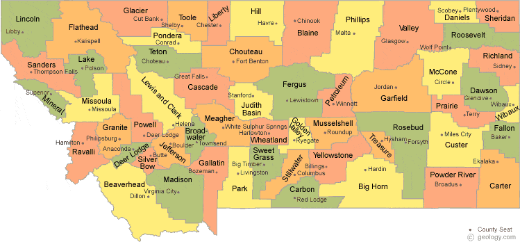

### Introduction

Hierarchical clustering offers an opportunity not just to cluster data points, but the hierarchical structure also allows us to visualize how clusters were formed and how they are related to each other. As with any data analysis, the decisions made along the way can greatly impact the final outcome. One of the decisions to be made with hierarchical clustering is the method for measuring distance between clusters to determine which clusters should be combined and when, known as the linkage method. In this analysis I will be exploring several linkage methods for hierarchical clustering.

### Data set

The data set used in this analysis is comprised of child care data for the 56 counties in Montana. These data were collected from the Montana Early Childhood Project (ECP) Registry^1^. The small sample size and meaningful data points in this data set allows us to more easily interpret the results. A map of Montana counties is shown in Figure 1 for reference.



This data set includes 18 variables. One variable is withheld at the beginning so as to compare with the identified clusters. This categorical variable is the Beale Code for the county, also known as the Rural-Urban Continuum Code^3^. This coding system was created by the USDA to measure the urbanicity of a county. The full scale is from 1 (large metro area) to 9 (completely rural), but Montana counties range from 3 (smallest metro area) to 9.

```{r, warning = F, message = F}
# read in and reformat data
mt <- read.csv("mtcounty.csv", header = T) 
row.names(mt) <- mt$County
mt <- mt[c(-1)]
mt$Beale <- as.factor(mt$Beale)

# withhold beale code to compare to clusters
mt2 <- mt[c(-1)]
```

Fourteen of the variables are count data. Seven of these are counts at different levels on the ECP Career Lattice, and one is the total count at all levels. The levels primarily correspond to education and training in early childhood education, with the lowest level indicating less than a high school education, up through a doctorate in EC at the highest level.

Another of the count variables is the number of programs participating in the Quality Rating Improvement System. There are also variables measuring the number of center based programs, and home-based programs, in the county.

There are three count variables related to training that has occurred in the county recently. One is the number of classroom-based training events that took place within the county. The others are the number of individuals from each county that participated in classroom-based training, and online training. 

There are three quantitative variables related to wages. One is the average wage of the workforce, which includes a wide variety of roles. There is also the average wage of a teacher, and of an assistant teacher. 

Summary statistics for each of the variables are shown in the table below. Due to the geography of Montana, a large number of counties have very low counts on many of the count variables This results in skewed distributions, and can be seen in the low median values as compared with the mean values.

```{r, warning = F, message = F}
library(psych)
library(knitr)
descMt2 <- describe(mt2)
kable(descMt2[c(2:5, 8:10)])
```

The three wage variables contain missing values. Half of the counties have too small of populations to be able to report wages without being identifying. Of the 56 counties, 28 are missing wage data. Figure 2 shows this missing data pattern.

```{r, warning = F, message = F, fig.cap = "Figure 2. Twenty-eight counties are missing responses on the three wage variables. These are the only missing responses in the data set.", fig.height=4, fig.width=10}
library(mice)
mtPattern <- md.pattern(mt, rotate.names = T)
```

### Measuring dissimilarities

Another decision that needs to be made in clustering is how to measure dissimilarity among data points. Since I have mixed data types and missing values, I am using a modified version of Gower's method to handle missing values in calculating the dissimilarity between observations. The dissimilarity between each pair of observations is calculated by using the variables that are not missing responses.

```{r, warning = F, message = F}
# distance matrix using gower's method and dealing with missing values
library(vegan)
distmt2 <- vegdist(mt2, method = "gower", na.rm = TRUE)
```

### Linkage methods

I will be exploring hierarchical clustering with four different agglomerative (or "bottom up") methods: Single linkage, Complete linkage, Average linkage, and Ward's Agglomerative linkage method.

#### Single Linkage 

Single linkage combines clusters by finding the minimum distance between the two closest points of clusters. This often results in a chaining effect which is demonstrated in Figure 3. There is little structure to this tree other than the chaining effect, making it challenging to find well-defined clusters. Using the longest height between cuts in the tree would result in Yellowstone, Cascade, Lewis and Clark, Gallatin, Missoula, and Flathead counties in their own clusters, and the rest in another cluster.

```{r, warning = F, message = F, fig.cap = "Figure 3. Dendrogram using single linkage.", fig.height=8, fig.width=11}
# single linkage
hcmt2C <- hclust(distmt2, "single")
plot(as.dendrogram(hcmt2C), main = "Cluster Dendrogram using Single Linkage")
```

#### Complete Linkage 

Complete linkage takes the opposite sort of approach, and combines clusters by finding the minimum distance of the furthest points in the two clusters. Figure 4 shows this method, which has a very different structure from the single linkage method. Here we can see Yellowstone, Gallatin, and Missoula counties vs. the rest was the last to be joined. Considering the next to be split, we have a split in the larger group forming a new cluster containing Cascade, Lewis and Clark, Flathead, and Silver Bow counties.

```{r, warning = F, message = F, fig.cap = "Figure 4. Dendrogram using complete linkage.", fig.height=8, fig.width=11}
# complete linkage
hcmt2C <- hclust(distmt2, "complete")
plot(as.dendrogram(hcmt2C), main = "Cluster Dendrogram using Complete Linkage")
```

#### Average Linkage 

Average linkage forms a compromise between the two methods above by merging according to the average distances between points in the clusters. This method is shown in Figure 5. Here we have Yellowstone, Gallatin, Missoula, Cascade, Lewis and Clark, Flathead, and Silver Bow split into a separate cluster together. The next cut would split these two clusters into the same two clusters seen above with complete linkage.

```{r, warning = F, message = F, fig.cap = "Figure 5. Dendrogram using average linkage.", fig.height=8, fig.width=11}
# average linkage
hcmt2A <- hclust(distmt2, "average")
plot(as.dendrogram(hcmt2A), main = "Cluster Dendrogram using Average Linkage")
```

#### Ward's Agglomerative Linkage 

Ward's method uses the minimum error sum of squares between clusters to merge clusters. The result of using this method is shown in Figure 6. Here the only clear choice of number of clusters is two. This puts Yellowstone, Gallatin, Missoula, Cascade, Lewis and Clark, and Flathead in one cluster, and the rest in the other cluster. Using this method, Silver Bow county was clustered with the larger group.

```{r, warning = F, message = F, fig.cap = "Figure 6. Dendrogram using Ward's Agglomerative linkage method.", fig.height=8, fig.width=11}
# ward's method
hcmt2W <- hclust(distmt2, "ward.D2")
plot(as.dendrogram(hcmt2W), main = "Cluster Dendrogram using Ward's Method")
```

### Number of clusters

Based on the heights of the splits, the different linkage methods seem to indicate that two, possibility three, clusters would be reasonable The larger group of counties that tended to be clustered together all have smaller populations, and have smaller counts on the count variables. 

To differentiate in a bit more depth, let's move forward with three clusters and attempt to visualize these clusters. With three clusters, Average and Complete linkage created the same clusters, so we will use that result. The majority of counties (49 of the 56 counties) were in what we'll refer to as cluster 1. We have cluster 2 containing Cascade, Lewis and Clark, Flathead, and Silver Bow counties. Then we have Yellowstone, Gallatin, and Missoula counties in cluster 3. Note that Ward's method was also very similar to this cluster breakdown, with the exception of Silver Bow county. 

```{r, warning = F, message = F}
# cluster assignments
cutree(hcmt2A, 3)
```

### Comparing clusters to Beale Code

Figure 7 shows a mosaic plot of our three chosen clusters by our withheld variable, Beale Code. This diagram shows there is a clear relationship between these factors. Clusters 2 and 3 are made up entirely of Beale Codes of 3 and 5, with cluster 3 majority Beale Code 3, and cluster 2 majority Beale Code 5. Cluster 1 contains all of Beale Codes 6-9, as well as one county classified with a Beale Code of 3. 

In summary, all metropolitan areas, as well as the largest non-metro areas, were clustered into clusters 2 and 3, with the exception of one county. This unusual county is Carbon county. Carbon county is pretty average in terms of population size, but is classified with a Beale Code of 3 because it belongs to the greater Billings metropolitan area. It is interesting to note that in terms of this data, Carbon county aligns more closely with the smaller county cluster than its neighbor Yellowstone county.

```{r, warning = F, message = F, fig.cap = "Figure 7. Mosaic plot of clusters vs. Beale code.", fig.height=6, fig.width=8}
# compare clusters to beale code
library(RColorBrewer)
tableMt <- table(factor(cutree(hcmt2A, 3)), mt$Beale)
tableMt
mosaicplot(tableMt, xlab = "Beale Code", ylab = "Clusters", 
           dir = c("h", "v"), off = 15, legend = T,
           main = "", color = brewer.pal(n = 6, name = "PuBuGn"))
```

### Visualization of clusters

Figure 8 shows a parallel coordinate plot to visualize the counties across all variables by the three identified clusters. This plot shows the clear differences between the cluster averages across all of the variables, with cluster 3 having the highest responses, cluster 2 in the middle, and cluster 1 very low. This plot also demonstrates how most counties in cluster 1 are close to zero on all the count variables.

```{r, warning = F, message = F, fig.width=8, fig.height=5, fig.cap = "Figure 8. Parallel coordinate plot with counties in dashed lines and colored by cluster. The mean response for each cluster is shown with the solid line.", fig.height=7, fig.width=11}
# scale btwn 0 and 1 for pcp
scale01 <- function(vec){
   vec1 <- vec[!is.na(vec)]
   (vec-min(vec1))/(max(vec1)-min(vec1))
}
mt2Sc <- sapply(mt2, scale01)

# color palette
palette(brewer.pal(n = 3, name = "Set2"))

# parallel coordinate plot
matplot(t(mt2Sc), ylab = "Scaled responses", 
        xaxt = "n", type = "l", lwd = 2, lty = 2,
        col = factor(cutree(hcmt2A, 3)))
tics = 1:ncol(mt2)
xlabs <- names(mt2)
tck = axis(1, at = tics, labels = FALSE)
text(tck, par("usr")[3], labels = xlabs, srt = 310, xpd = TRUE, 
     adj = c(-0.2, 1), cex = 0.65)

# add means on 0,1 scale
library(dplyr)
library(tibble)
mt2Sc2 <- mutate(as_tibble(mt2Sc), 
                    Cluster = factor(cutree(hcmt2A, 3))) 
means <- mt2Sc2 %>% group_by(Cluster) %>% summarise_all(mean, na.rm = TRUE)

# plot scaled means
matplot(t(means[c(-1)]), add = T, type = "l", lty = 1, lwd = 4,
        col = means$Cluster)
legend("topright", legend = means$Cluster, lwd = 4,
       col = means$Cluster)
```

The clusters follow the same pattern on the wage variables, with cluster 3 highest, cluster 2 in the middle, and cluster 1 lowest. The average assistant teacher wage shows the least differentiation among the clusters, with cluster means all close to the average of this variable. Figure 9 shows bean plots of the average wage of the workforce on the original scale by cluster.

```{r, warning = F, message = F, fig.cap = "Figure 9. Bean plot of average wage by cluster.", fig.height=6, fig.width=8}
library(beanplot)
beanplot(mt2$Average.wage ~ factor(cutree(hcmt2A, 3)), 
         method = "jitter", log = "", xlab = "Cluster",
         ylab = "Wage (dollars)",
         col = list("#66C2A5", "#FC8D62", "#8DA0CB"))
```

### Summary and future work

Complete linkage, Average linkage, and Ward's method resulted in similar overall results. Single linkage suffered from extreme chaining, and was not very useful in terms of defining clusters. Although there were differences in where the splits were made, there was clear agreement among the methods on which counties were different enough to warrant belonging to a separate cluster, with Yellowstone, Gallatin, Missoula, Cascade, Lewis and Clark, and Flathead always separated from the rest. Silver Bow county was included in this separate cluster in two of the four methods.

Another variable I considered including is the Child Care Resource and Referral (CCR&R) region. CCR&R agencies have the state divided into seven distinct regions, with one local office dedicated to serving each region. In future analyses, this would be another variable that would be interesting to withhold and compare to clusters.

This data set contains a lot of very similar data points, with a handful of data points that were quite different from the main cluster. Hierarchical clustering can be sensitive to outliers, so this would impact the outcome. It would be interesting to conduct this analysis with another data set not containing those outliers, and observe differences between the different linkage methods in that case.

### References

1. Practitioner Registry [database]. Montana Early Childhood Project. https://mtecp.org/. Accessed April 2020.

2. Montana County Map with County Seat Cities. Geology.com. https://geology.com/county-map/montana.shtml. Accessed April 2020. 

3. Rural-Urban Continuum Codes. USDA ERS - Rural-Urban Continuum Codes. https://www.ers.usda.gov/data-products/rural-urban-continuum-codes.aspx. Accessed April 2020. 

4. R Core Team. R: A language and environment for statistical computing. R Foundation for Statistical Computing, Vienna, Austria. 2018.

5. Revelle, W. psych: Procedures for Personality and Psychological Research, Northwestern University, Evanston, Illinois, USA. Version = 1.9.12. 2019. https://CRAN.R-project.org/package=psych.

6. Xie Y. knitr: A General-Purpose Package for Dynamic Report Generation in R. R package version 1.28. 2020.

7. Van Buuren S, Groothuis-Oudshoorn K. mice: Multivariate Imputation by Chained Equations in R. Journal of Statistical Software, 45(3), 1-67. 2011. https://www.jstatsoft.org/v45/i03/.

8. Oksanen J, Blanchet F G, Friendly M, Kindt R, Legendre P, McGlinn D, Minchin P R, O'Hara R B, Simpson G L, Solymos P, Stevens M H H, Szoecs E, Wagner H. vegan: Community Ecology Package. R package version 2.5-6. 2019. https://CRAN.R-project.org/package=vegan

9. Neuwirth E. RColorBrewer: ColorBrewer Palettes. R package version 1.1-2. 2014. https://CRAN.R-project.org/package=RColorBrewer

10. Wickham H, François R, Henry L, Müller K. dplyr: A Grammar of Data Manipulation. R package version 0.8.5. 2020. https://CRAN.R-project.org/package=dplyr

11. Müller K, Wickham H. tibble: Simple Data Frames. R package version 3.0.0. 2020. https://CRAN.R-project.org/package=tibble

12. Kampstra P. Beanplot: A Boxplot Alternative for Visual Comparison of Distributions. Journal of Statistical Software, Code Snippets 28(1). 1-9. 2008. http://www.jstatsoft.org/v28/c01/.
